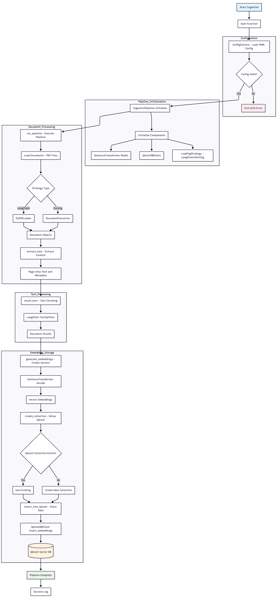
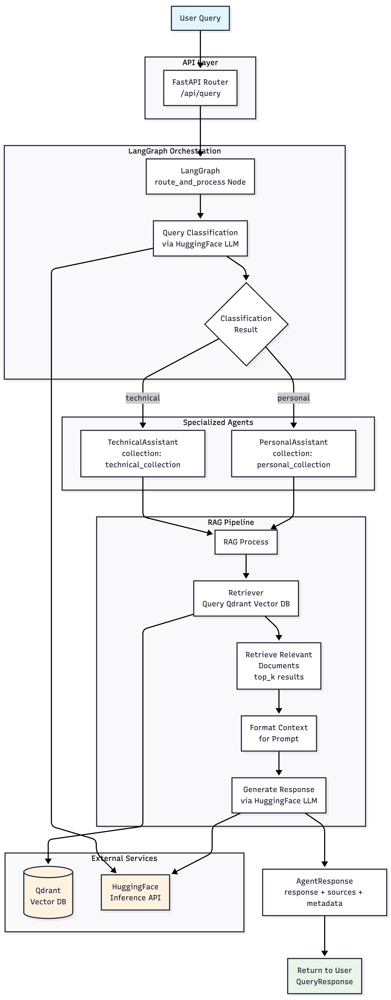

# Agentic RAG Personal Chat System

An intelligent conversational system using LangGraph for agent orchestration and RAG (Retrieval Augmented Generation) for enhanced responses.

## Features

- 🤖 Multi-agent system with specialized agents for different query types
- 📚 Retrieval-augmented generation for knowledge-grounded responses
- 🧠 Smart query routing based on content analysis
- 🔄 Modular architecture with LangGraph orchestration
- 🌐 FastAPI backend with easy-to-use endpoints

## Architecture

This system consists of:

1. **LangGraph Orchestration**: Manages the flow between different agents
2. **Specialized Agents**: Technical assistant and personal assistant
3. **Vector Database**: Uses Qdrant for efficient similarity search
4. **FastAPI Backend**: Provides REST endpoints for interaction

## Getting Started

### Prerequisites

- Docker and Docker Compose
- Python 3.11+

### Installation

Clone the repository:

```bash
git clone https://github.com/yourusername/agentic-rag-personal-chat-system.git
cd agentic-rag-personal-chat-system
```

Install dependencies:

```bash
pip install -e .
```

### Running with Docker

The system is containerized with three main services:

- **Qdrant**: Vector database (port 6333)
- **Backend**: FastAPI API server (port 8000)
- **Frontend**: Web interface (port 3000)
- **Ingestion**: Data processing service (runs on-demand)

#### Quick Start - All Services

```bash
# Start all services
make docker-all
# or
docker-compose up --build
```

#### Individual Services

```bash
# Backend only (with database)
make docker-backend

# Frontend only
make docker-frontend

# Database only
make docker-db

# Run data ingestion (one-time job)
make docker-ingest
```

#### Service URLs

- **API**: http://localhost:8000
- **Frontend**: http://localhost:3000
- **Qdrant Dashboard**: http://localhost:6333/dashboard

#### Docker Commands

```bash
# View logs
make docker-logs

# Stop all services
make docker-stop

# Clean up (removes volumes)
make docker-clean

# Rebuild all images
make docker-rebuild
```

### Running Locally

Start the FastAPI server:

```bash
uvicorn src.agentic_rag_personal_chat_system.backend.src.api:app --reload
```

## API Usage

### Chat Endpoint

```bash
curl -X POST "http://localhost:8000/chat" \
  -H "Content-Type: application/json" \
  -d '{"query": "How do I fix a memory leak in my Python code?", "mode": "auto"}'
```

Response:

```json
{
  "response": "To fix a memory leak in Python...",
  "agent_type": "technical",
  "sources": [
    {"text": "Example source", "source": "technical_collection", "relevance": 0.98}
  ],
  "metadata": {},
  "error": null
}
```

## Development

### Project Structure

```
src/
  backend/
    src/
      graph.py           # LangGraph implementation
      api.py             # FastAPI application
  ingestion/             # Data ingestion pipeline
  frontend/              # Frontend components (placeholder)
```
### Ingestion Architecture


### Backend Architecture


## License

[License information]
